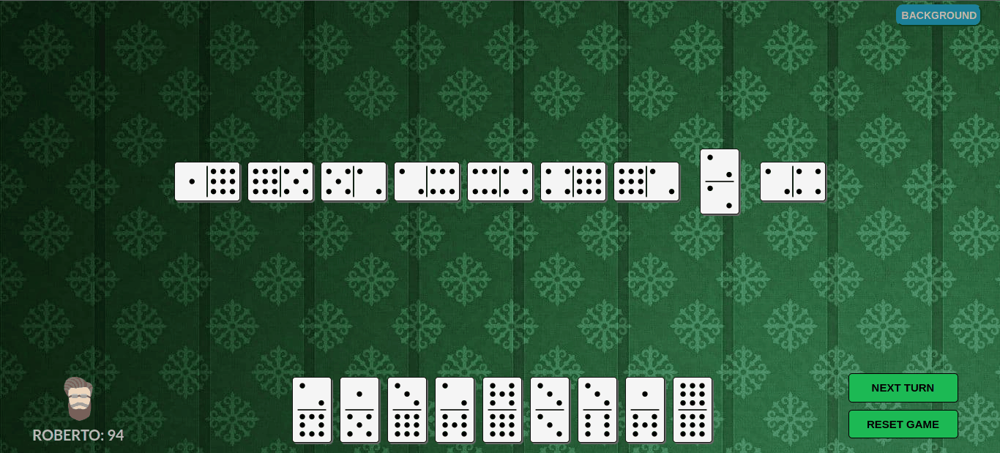
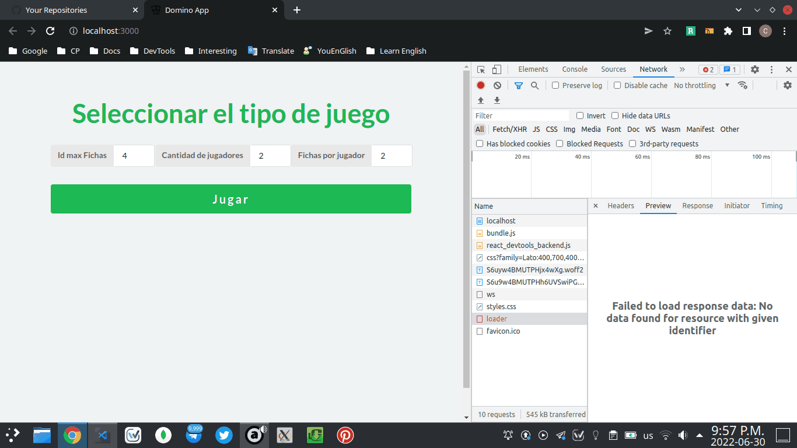
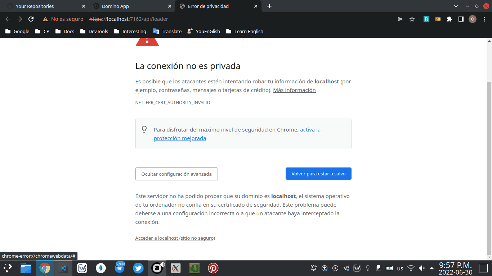

# Domino

> Proyecto de Programacion II




[Orientacion del proyecto](https://github.com/matcom/domino)


Esta aplicación es una simulación de un jugador de domino, en donde usted podrá jugar diferentes variantes del juego de domino clásico, cambiando las reglas de juego a su gusto.

La aplicación está compuesta por una interfaz gráfica desarrollada en [React](https://es.reactjs.org/) y servidor con una API y toda la lógica del juego desarrollado en [C# .net6](https://docs.microsoft.com/en-us/dotnet/).


## Dependencias e instalación local

**Instalar Node, Yarn y .NET 6.0**

- Para instalar .NET 6.0 visitar su [pagina oficial](https://dotnet.microsoft.com/en-us/download/dotnet/6.0).

- Para instalar node.

```bash
curl -fsSL https://deb.nodesource.com/setup_18.x | sudo -E bash -
sudo apt-get install -y nodejs
```


- Para instalar yarn:

```bash
#Instalar yarn
npm install -g yarn
```

### Dependencias del proyecto

Entre las dependencias internas para la aplicación del lado del cliente, ademas de usar react también se usaron otras librerías:

1. [Semantic UI React](https://react.semantic-ui.com/): componentes prediseñados de elementos típicos en una web
2. [Sass](https://sass-lang.com/documentation): procesador de css
3. [React Toastify](https://fkhadra.github.io/react-toastify/introduction): para crear alertas en tus apps

Para instalar las dependencias de node se va a la carpeta `Client` y se ejecuta el comando:

```bash
#Instalar dependencias
yarn install
```

## Ejecución de la aplicacion

En la carpeta `Server` ejecutamos el comando siguiente para levantar el servidor:

```bash
#Ejecutar servidor
dotnet run
```

En la carpeta `Client` ejecutamos el comando siguiente para levantar la aplicación:

``` bash
#Ejecutar como aplicacion web
yarn start
```
### Posible error al ejecutar la aplicación

Si al ejecutar la aplicación no te carga las opciones para seleccionar el tipo de juego es porque tu navegador esta bloqueando el acceso de la url de la api. Para quitar este error, nos vamos a las herramientas de desarrollo del navegador( click derecho en cualquier lugar y después en inspeccionar ).

Luego en la pestaña de `Network` verás un listado con la palabra `loader` en rojo(si no se ve recargar la paguina). Esta es la primera petición que hace la app al server y es rechazada.



Si das doble click ahí aparecerá al lado la información de la petición y el link al cual se hizo. Le damos doble click al link y nos abrirá una ventana la cual estará bloqueada por el navegador.

Lo único que tenemos que hacer es darle click a `Mostrar configuración avanzada` y después a `Acceder a localhost(sitio no seguro)`. Esto eliminará la restricción y podrás acceder sin problemas a la información devuelta por la api.



Ya solo queda recargar la páguina del juego y verificar que salgan las opciones.

## Añadir nueva variación de una caracteristicas

Para conocer como esta escructurado el proyecto desde la parte del desarrollo de softweare, por favor leer el [Report](./Report.md) y después continua con este sección


Si tienes una nueva implementación diferente de una de las características que se pueden variar del juego sigue estos pasos:

**1. Crear la clase** 

En la carpeta `Data/SpecificGames` buscas la parte del juego que quieres crear nueva, y crea una clase en un ***_fichero.cs_*** nuevo que implemente la interfas o herede la clase corresponiente e implementas la variación guiandote por los requisitos que debe cumplir cada método.

**2. Añadir los datos**

En la carpeta `Data` modificas la clase `Data` y añades una nueva instancia al arreglo del tipo de variación creada

**3. Añadir descripción**

En la carpeta `Models` se modifica el fichero `GetOptions.cs` y se añdade en el grupo de opciones correspondiente, en el array de `nameOptions` de ese grupo una descripción identificadora de la implementación desarrollada.

**Importante:** Es importante que las descripciones de las variaciones tengan el mismo orden que las instancias de las clases que identifican cada una de las descripciones añadidas, ya que estos se seleccionarán dinámicamente por el índice que ocupen en el array. Si no tienen un orden correcto, este puede traer errores en la ejecución del juego.


## Desarrolladores

Carlos Manuel Gonzalez Peña: [@cmglezpdev](https://github.com/cmglezpdev)

Jorge Alberto Aspiola Gonzalez: [@aspio28](https://github.com/aspio28)