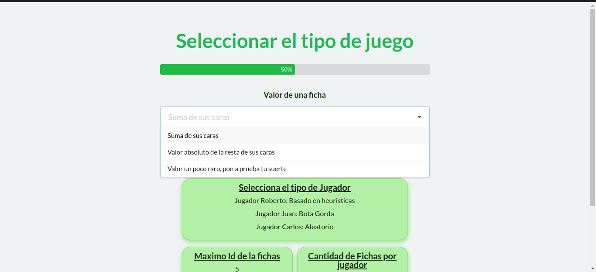
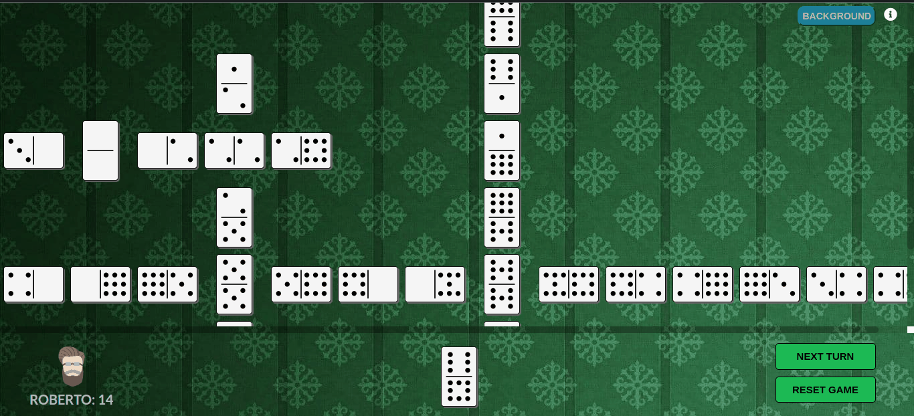
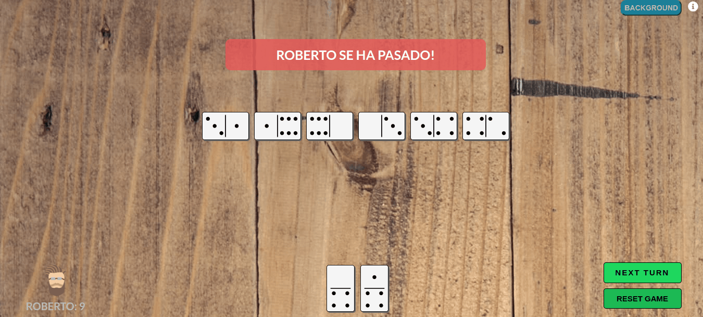
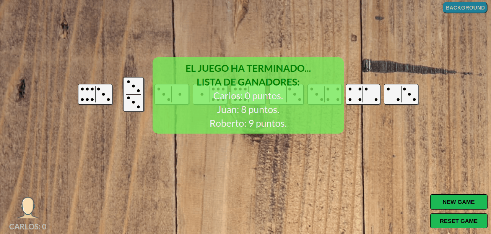
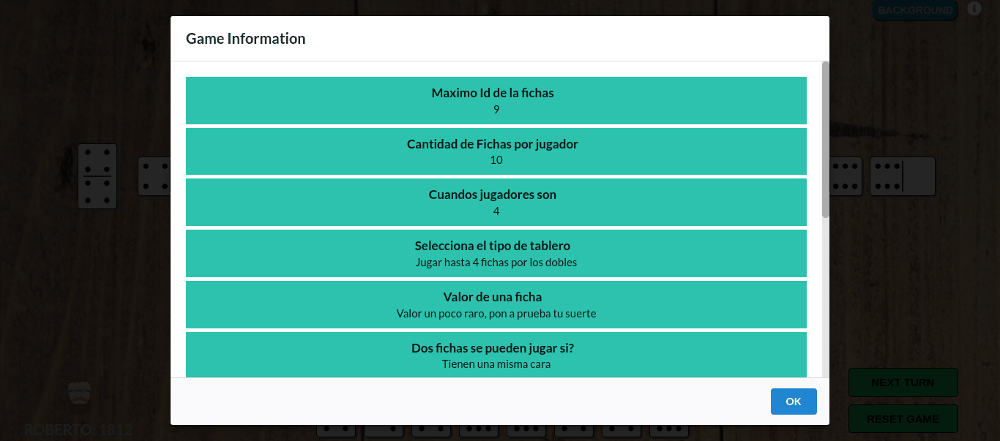

# Report

## Indice general

- [Report](#report)
  - [Client](#client)
  - [Server](#server)
    - [Controllers y Models](#controllers-y-models)
    - [Data](#data)
    - [Game](#game)
    - [AuxiliarClasses](#auxliliar-classes)
    - [Vista general de la Abstracciones](#vista-general-de-la-abstracciones)
    - [Abstracciones especificas](#abstracciones-especificas)
    - [Tablero](#tablero)
      - [Tablero clásico](#tablero-clásico)
      - [Tablero con mas caminos](#tablero-con-mas-caminos)
    - [Estrategia de un jugador](#estrategia-de-un-jugador)
      - [Random Player](#random-player)
      - [Bota Gorda Player](#bota-gorda-player)
      - [Heuristic Player](#heuristic-player)
    - [Distribución de las fichas por los jugadores](#distribución-de-las-fichas-por-los-jugadores)
      - [Random Distribution](#random-distribution)
      - [Todas las fichas del mismo tipo](#todas-las-fichas-del-mismo-tipo)
    - [Valor de las fichas](#valor-de-las-fichas)
      - [Suma de caras](#suma-de-caras)
      - [Resta de caras](#resta-de-caras)
      - [Cálculo raro y aleatorio](#cálculo-raro-y-aleatorio)
    - [Final de la partida](#final-de-la-partida)
      - [No se puede seguir jugando](#no-se-puede-seguir-jugando)
      - [Todos se pasan](#todos-se-pasan)
    - [Siguiente Jugador](#siguiente-jugador)
      - [Orden del domino clásico](#orden-del-domino-clásico)
      - [Orden aleatorio](#orden-aleatorio)
      - [Invirtiendo el orden](#invirtiendo-el-orden)
      - [Todas las fichas](#todas-las-fichas)
    - [Ganador](#ganador)
      - [Más puntos](#más-puntos)
      - [Menos puntos](#menos-puntos)
    - [Conexión de Fichas](#conexión-de-fichas)
      - [Caras iguales](#caras-iguales)
      - [Conexiones raras](#conexiones-raras)
  
## Client

El cliente de la aplicación no es más que la interfaz gráfica del juego, está desarrollada con un **React**, **un framework de Javascript** para desarrollo web. Este está completamente separado del `Server` y estos se comunican mediante peticiones `http` intercambiándose informaciones entre ellos para poder crear un flujo en el juego.

Lo primero que vemos al correr nuestro juego es un menú de opciones para poder seleccionar el tipo de juego que queremos jugar, seleccionando por separado las diferentes variaciones de funcionalidades importantes del mismo.



En el menú se muestra un barra de progreso que se va llenando a medida que vas seleccionando una opción de cada variación del juego y en la parte inferior se va mostrando las opciones que vas escogiendo.

Una vez que seleccionas todos las variaciones deseadas aparecerá el botón de `play` para iniciar el juego.

<hr width="200px">

Una vez iniciado el juego tendremos una interfaz dividida en dos secciones.



En la sección más grande tendremos el tablero del juego, el cual en dependencia del tipo de juego seleccionado mostrará las fichas jugadas de una forma o de otra. Estas fichas al salirse del tamaño de la pantalla se podrá hacer scroll para poder ver todas las esquinas del juego.

En la parte inferior tenemos la infomación del jugador actual y dos botones, **NEXT TURN** para dar paso a que juege el otro jugador y el **RESET GAME** que es para reiniciar la partida con la misma configuración seleccionada. Una vez el juego concluya el botón **NEXT TURN** dirá **NEW GAME** el cual te permitirá seleccionar otra configuración para poder jugar una nueva partida con opciones diferentes.

Ahí también tenemos en el medio, las fichas del jugador actual que está jugando y a la izquierda tenemos una miniatura de una cara representando al jugador y el nombre del mismo con sus respectivos puntos hasta ese momento de la partida.

Si un jugador se pasa o se termina el juego, saldrá en el medio de la pantalla un cartel rojo mostrando **El jugador <nombre> se ha pasado!!**, y en caso de que el juego halla finalizado mostrará la lista de jugadores en el orden definido por la variación de "quien gana el juego" seleccionada al principio. Aqui un ejemplo




Y en la parte superior derecha tendremos dos botones: el **BACKGROUND** que es para poder cambiar la imagen del tablero, y el botón a su derecha con el ícono **"i"** que es para poder ver las opciones del juego seleccionadas al principio, que corresponden con la variación que se está jugando.



### Un poco sobre el softweare

Nuestra aplicación al principio hace una petición `http` al servidor para que este nos de la información sobre las opciones a mostrar al usuario. Esta al ser cargada se muestra dinámicamente mediante componentes que reciben la información, por lo que si se añade más opciones este será capaz de adaptarse correctamente. 

El usuario constará con pequeñas validaciones mientras selecciona las opciones, mostrando un mensaje de error si este comete alguno. También tiene un seguimiento en la parte inferior que se va generando dinámicamente y guardando las selecciones hechas para mejor feedback. 

Todas estas opciones se guardan en un `Context` general y se va actualizando con cada selección y, al final de todas las opciones este se enviará al servidor mediante otra petición http y donde el server devolverá la información incial para mostar en el juego.

Una vez dentro del mismo, al dar click en el boton de **NEXT TURN**, este hará una petición http al servidor pidiendo los datos de la nueva jugada, la cual será cargada y mostrada en pantalla.

Cuando termine la partida y se toca el boton de **NEW GAME** lo que hace la aplicación es borrar esos datos que tenia guardado en el `Context` y automáticamente cambia la vista para poder seleccionar una nueva variante del juego.

Si por el contrario de da click en el boton de **RESET GAME** este lo que hace simplemente es realizar nuevamente la misma petición http que se hizo al principio para reiniciar el juego en nuestro server, manteniendo las mismas opciones del juego actual.

## Server

El servidor del juego es una **API REST** desarrollada en C#, este tiene tres controladores que se comunican con el Cliente para mandar y recibir información y tiene también toda la lógica del juego, clases, implementaciones, etc.

En el `Server` tenemos los controladores de la API(`Controllers`), los modelos(`Models`) que son clases bases para el envío y recibimiento de los request del Cliente, y la parte de `Data` que contiene toda la lógica de la aplicación.

### Controllers y Models

**LoaderController**: Este controlador es la primera petición que se realiza en el `Client` y es el que carga la clase `InterfaceOfOptions` que está dentro de los `Models` que tiene un conjunto de informaciones relacionadas con las diferentes variaciones ya desarrolladas del juego que se mostrarán en el cliente (id, nombre y descripcion).

**TypeGameController**: Una vez que el usuario en la interfaz gráfica termina de seleccionar los diferentes aspectos para generar una variación del juego, esta información es mandada al `Server` y este `Controller` lo que hace es recibir esas opciones y usa las clases correspondientes para construir nuestro `Manager`(Clase que controla el flujo del juego). Una vez hecho esto, se inicializa el juego y se manda la información inicial de la partida de vuelta al cliente.

**NextTurnController**: Este `controller` se ejecuta cada vez que en el juego corresponde a un nuevo turno, en donde este se encarga de ejecutar los métodos necesarios del `Manager` para realizar la próxima jugada, y devuelve la información correspondiente de esa jugada que se realizó.

### Data

La sección de la `Data` tiene una clase principal `Data` que tiene varios arrays de instancias de las variaciones que tenemos implementadas en el juego, asi como varios métodos que 'parsean' algunas informaciones del juego en una estructura específica para que sea más fácil usar esa información en el `Client`(usando JSON)

```cs

// Datos correspondientes a la cantidad de jugadores posibles a seleccionar
public int[] countPlayers = new int[] {
    2,
    3,
    4,
    5,
    6,
    7,
    8,
    9,
    10
};
// Datos correspondientes al maximo numero que se le podra poner a una ficha
public int[] maxIdTokens = new int[] {
    3,
    4,
    5,
    6,
    7,
    8,
    9,
};
// Cantidad de fichas que se seleccionará por jugador
public int[] countTokens = new int[] {
    3,
    4,
    5,
    6,
    7,
    8,
    9,
    10,
    11,
    12,
    13,
    14,
    15,
    16,
    17,
    18,
    19,
    20,
};
// varaiciones de los jugadores
public Player[] Players = new Player[] {
    new RandomPlayer(),
    new BotaGordaPlayer(),
    new HeuristicPlayer(),
};
// Variaciones del tablero
public IBoard[] Boards = new IBoard[] {
    new UnidimensionalBoard(),
    new MultidimensionalBorad(),
};
// Variaciones de como se calcula el valor de una ficha
public TokenValue[] TokensValue = new TokenValue[] {
    new SumOfFaces(),
    new SubOfFaces(),
    new RareProperties(),
};
// Variaciones de como se pueden colocar dos fichas en el tablero
public IMatch[] Matches = new IMatch[] {
    new EqualFace(),
    new RareEquivalence(),
};
// Variaciones de como se distribuye las fichas entre los jugadores
public IDistributeTokens[] DistributeTokens = new IDistributeTokens[] {
    new RandomDistribution(),
    new AllforOneDistribution(),
};
// Variaciones de como se finaliza el juego 
public IFinishGame[] FinishGames = new IFinishGame[] {
    new AllPassFinish(),
    new APassFinish()
};
// variaciones de como se gana el juego
public IWinGame[] WinGames = new IWinGame[] {
    new FewPoints(),
    new ALotPoints()
};
// Variaciones de como se selecciona el proximo jugador
public INextPlayer[] NextPlayers = new INextPlayer[] {
    new OrderTurn(),
    new RandomTurn(),
    new InvertedTurn(),
    new NextPlayerLongana(),
};

```
Además de esto tenemos una estructura de directorios formada por:
`Classes`: Contiene las clases generales del juego o que no necesitan de una interfaz.
`Interfaces`: Representa una parte de la abstracción del juego, en donde cada interfaz representa una posible variación de una característica del juego, las cuales son las seleccionadas desde el `Client`.
`SpecificGames`: Esta tiene más directorios dentro con las implementaciones de las variaciones respectivas de todas las funcionalidades del juego que son variables.

### Game

También tenemos una clase estática `Game` la cual tiene la instancia general del Manager y dos métodos que "parsean"(lo que hacen es cambiar los nombres de las pripiedades) para que cuando se convierta a formato JSON que no sea con los nombres por defecto que asigna C# 

El primer método es :

```cs
public static List<FacesToken> TokenForJson( IEnumerable<Token> tokens );
```

el cual te parsea una lista de fichas a este formato:

```cs
public class FacesToken {
    public int? Left {get; set;} // valor de la cara izquierda
    public int? Right {get; set;} // valor de la cara derecha
    public string? Direction {get; set;} // direccion de la ficha en el tablero
}
```

que en JSON se veria asi:

```json
{
    "left": <value:int>,
    "right": <value:int>,
    "direccion": "<direction:string>"
}
```


El método `PlayersForJson` parsea una lista de players con su información:

```cs
public static List<ResPlayer> PlayersForJson( PlayerInfo[] players, Refery refery ); 
```

Que lo transforma a:

```cs
public class PlayerInfo {
    public int? Id {get; set;}
    public string? Name {get; set;}
    public int? Points {get; set;}
    public FacesToken[]? HandTokens {get; set;}
}
```

y el método `TokensInBoardJson` que recibe la la matriz que representa el tablero y la convierte en una matriz de tokens parseados

```cs
public static List<List<FacesToken>> TokensInBoardJson ( (Token, string)[,] Tokens );
```


### Auxiliar Classes

En el archivo `AuxiliarClasses.cs` tenemos varias clases, que son clases auxiliares para tareas específicas, como es el caso de las que usamos para parsear la información de alguna colección, los estados del juego entre otras cosas.

En este archivo podemos ver varias clases como:

`StatusCurrentPlay`: Esta clase guarda algunas informaciones del estado del juego después de cada jugada realizada. Esta clase es usada por el manager para capturar la información de cada jugada, información que es pública ha todas las clases, pero principalmente pensada para los que los jugadores la puedan usar para sus estrategias.

`PlayInfo`: Esta clases también guarda información de las jugadas, pero esta clase contiene mas información que la otra porque es la información que se manda al frontend para que sea mostrada.

`PlayerInfo`: Esta clase contiene información basica sobre un jugador( cantidad de fichas, puntos, y sus ids ). Esta clase es usada por el `refery` y se usa para cuando queremos retornar información de un jugador pero no queremos que no se tenga acceso a sus métodos para evitar, entre otras cosas, que los jugadores que necesiten de información de otro jugador hagan trampa.  

`ResPlayer`: Esta clase también guarda la información de un jugador, pero esta clase en específico es la que se usa como parseo a JSON para que sea enviada al frontend

`FacesToken`: Esta clase parsea la información basica de una ficha( valor de sus caras, y su dirección en el tablero si esta allí ) a JSON para que sea usada en el frontend.

Como te habrás dado cuenta, hay clases que guardan los datos de las mismas cosas pero una guarda mas información que otra. Esto se podía guardar todo en una mima clase y solo asignarle valores a las cosas que creamos conveniente, pero esto implicaría que las demás propiedades sean nulas, dando paso a posibles errores a la hora de usar las clases, así como no tener una idea clara de cuales SI son las propiedades que tienen valores y cuales no. Es por eso que preferimos crear varias clases que se referieren a la misma cosa, pero guardan diferentes cantidades de información.


### Vista general de la Abstracciones

Dentro de la sección `Classes` las principales clases son: 
- `Manager`, el cual es el encargado de controlar el flujo de la partida, y posee todas las características(reglas) seleccionadas por el usuario. 
Esta clase tiene un constructor que recibe la mayoría de la información con la que se iniciará el juego(jugadores, tablero y demas reglas) y las guarda internamente. 
Tiene une metodo `Start Game` que es llamado una sola vez y carga la face inicial del juego, o sea,  construye las fichas y las reparte entre los jugadores. 
También tiene otro metodo llamado `Game Play` que ejecuta una jugada de la partida, selecciona el jugador que le toca, realiza la jugada, actualiza los datos y retorna la información de dicha jugada.
Y por ultimo el método `Search Player Index` que dado el id de un jugador, busca su indice en el arreglo interno donde estan guardados los mismos.


- `Refery` la cual tiene la tarea de controlar las jugadas de cada jugador(esta clase la implementamos como forma de evitar el surgimiento de jugadores que incumplieran las reglas preestablecidas de la partida), además posee las fichas de todos los jugadores y les ordena a los mismos elegir que ficha jugar, revisando si la elegida es válida, y finalmente colocándola en el tablero.

```cs
public class Refery {

    //... propiedades y constructor

    // Guarda los jugadores y las fichas correspondientes
    public void MakeTokens(List<Token>[] hand, Player[] ply);
 
    // Relaiza la jugada del jugador IdPlayer
    public bool Play(int IdPlayer);
 
    // Devuelve las fichas correspondientes al jugador con ese id
    public Token[] Hand( int IdPlayer );

    // Cantidad de fichas del jugador
    public int Count(int IdPlayer);

    // Cantidad de puntos del jugador
    public int Points(int IdPlayer);

    // Buscar el jugador y devolver su indice
    public int SearchPlayerIndex(int IdPlayer);

    // Retorna el jugador
    public Player Player(int IdPlayer);

    // Retorna informacion del jugador
    public PlayerInfo[] PlayerInformation { get; }

    // Crea un clone del refery
    public Refery Clone();
}
```

- `Player` Esta clase es abstracta y contiene metodos generales de los jugadores. Tiene dos métodos abstractos, la cración del clon del jugador y `Play Token` que devuelve el indice de la ficha a ser jugada. También tiene la propiedad `IDPlayer` con el id y el nombre del jugador


Dentro de la carpeta `Interfaces` están las interfaces principales del juego que describes las abstracciones de las funcionalidades del mismo. Cada interfas representa una caracteríastica del juego que puede ser modificada siguiendo las reglas que la interfas establece.

Dentro de las variaciones que se puedes realizar estan:

- `IBoard`: especifica los metodos necesarios para poder crear una variación del Tablero
- `IDistributeTokens`: especifica los metodos necesarios para poder crear una variación de como se reparten las fichas a cada jugador
- `IFinishGame`: especifica los metodos necesarios para poder crear una variación de como se termina una partida
- `IMatch`: especifica los metodos necesarios para poder crear una variación de como dos fichas se pueden jugar(que tengan una cara en comun por ejemplo)
- `INextPlayer`: especifica los metodos necesarios para poder crear una variación de como se selecciona el próximo jugador a jugar.
- `ITokenValue`: especifica los metodos necesarios para poder crear una variación de como se calcula el valor de una ficha
- `IWinGame`: especifica los metodos necesarios para poder crear una variación de como se selecciona el/los ganadores del juego


### Abstracciones especificas

Dentro de los aspectos específicos variables del juego tenemos:

### Tablero

Los tableros es la clase que se encarga de mantener y darle forma a las fichas que los jugadores han jugado, esta puede variar en dependencia del tipo de juego que se quiera jugar, por lo que se creó la interfaz `IBoard`, que modela los métodos básicos que tiene un tablero.

Dentro de las responsabilidades que tienen los tableros está la construcción de las fichas que se van a usar para jugar mediante el método

```cs
public List<Token> BuildTokens(int MaxIdOfToken, TokenValue calcValue)
```

y además contiene otro método importante llamado:

```cs
public bool ValidPlay(Token token);
```

que usando una instancia de la clase [IMatch](#conexion-de-fichas) valida si una ficha puede ser jugada en el tablero.

#### Tablero clásico

Este es la primera variación del tablero y representa al tablero clásico, o sea, es una mesa en donde los jugadores solo pueden jugar fichas por las esquina izquierda o derecha de la cola de fichas ya jugadas.

#### Tablero con mas caminos

Este tablero es un poco diferente ya que, los jugadores pueden jugar sus fichas y estas pueden ser colocadas por los laterales de la pila de fichas ya jugadas o, si se jugó algún doble, entonces se podrán jugar por los cuatro lados de la ficha(las dos caras normales más por encima y por debajo), saliendo de este otra ramificación del tablero por donde se podrá jugar normalmente.

[Indice☝](#report)

<hr />

### Estrategia de un jugador

Abstraido en una clase abtracta `Player` que representa la estrategia de cualquier jugador. Posee desde la clase abstracta la asignación de su nombre y Id, y un método abtracto `PlayToken` que debe devolver la posición en el array que se le pasa de la ficha que desee jugar, si incumple este principio devolviendo un número de una posición inválida en el array, se considera un turno perdido.

```cs
public abstract int PlayToken( IBoard board, Token[] hand);
```


#### Random Player

Selecciona una ficha al azar de las posibles a jugar.

#### Bota Gorda Player

Selecciona entre todas sus fichas válidas la de más valor, siempre basándose en la implementación de valor seleccionada en la partida.

#### Heuristic Player

Jugador basado en unas heurístas simples, siempre intenta salir con un doble, y jugar la ficha cuyas caras estén más repetidas en su mano.

[Indice☝](#report)

<hr />

### Distribución de las fichas por los jugadores

Abstraido en una interfaz `IDistributeTokens` con un método `DistributeTokens` el cual debe ser implementado devolviendo la distribución de las fichas para la partida que el implementador desee.

```cs
List<Token>[] DistributeTokens(List<Token> tokens,int numberofplayers,int countTokens);   
```

#### Random Distribution

Reparte las fichas de forma aleatoria por cada jugador.

#### Todas las fichas del mismo tipo

Reparte las fichas siguiendo la idea de dar tantas fichas con igual representación en una de sus caras como se pueda, cuando no se puedan dar más se completan aleatoriamente.

[Indice☝](#report)

<hr />

### Valor de las fichas

Abstraido en una Interface `ITokenValue` con un método `Value` que recibe un `Token` y debe devolver un entero que represente el valor de esa ficha.

#### Suma de caras

El valor de una ficha esta dada por la suma del valor de sus caras.

#### Resta de caras

El valor viene dado por la diferencia de las caras de la ficha.

#### Cálculo raro y aleatorio

Auxiliandonos del tipo `Func` y `Random` creamos varias formas de calcular el valor de la ficha y aleatoriamente aplicamos una en la ficha dada.

Dentro de las formas de calcular el valor estan:

```cs
private int a(int right, int left){
    return (int)Math.Abs(Math.Pow(right,3) - Math.Pow(left, 2));
}
private int b(int right, int left){
    return (2 + right + left)/2;
}
private int c(int right, int left){
    return (int)Math.Abs((Math.Cos(left)-Math.Sin(right))*10);
}
private int d(int right, int left){
    return Math.Abs((right + left)*(right-left));
}
private int e(int right, int left){
    return (int)((Math.Sqrt(right) + Math.Log2(left + 1))*5);
}
private int f(int right, int left){
    return 0;
}
private int g(int right, int left){
    return 1000;
}
private int h(int right, int left){
    return (int)Math.Abs(Math.PI*(Math.Pow(right,2)-Math.Sqrt(left+10)));
}
```

Entonces cuando se consulte el valor de una ficha, este seleccionará un método de estos de forma random y devolverá como valor de la ficha la evaluación de la expresión matemática que contiene el método.

[Indice☝](#report)

<hr />

### Final de la partida

Abstraido en una interface `IFinishGame` con un método booleano `FinishGame` que recibiendo el estado del tablero y la información de cada jugador debe decidir si el juego terminó.

```cs
bool FinishGame( IBoard board, IEnumerable<PlayerInfo> players );
```

#### No se puede seguir jugando

El juego finaliza si alguien puso todas sus fichas o nadie tiene una ficha válida para jugar

#### Todos se pasan

El juego finaliza si alguien se queda sin fichas, o si al menos la mitad de los jugadores se pasan 2 veces.

[Indice☝](#report)

<hr />

### Siguiente Jugador

Abstraido en una interface `INextPlayer` que contiene el método `nextPlayer` que devuelve el ID del proximo jugador.

```cs
int NextPlayer( PlayerInfo[] players );
```

#### Orden del domino clásico

El orden clásico, fijo donde se preestablece un orden al iniciar la partida y ese se mantiene hasta el final de la partida.

#### Orden aleatorio

El siguiente jugador es seleccionado de forma aleatoria.

#### Invirtiendo el orden

El juego comienza con un orden establecido, pero si alguien se pasa este orden es invertido.

#### Todas las fichas

El mismo jugador repite su turno hasta que no le queden jugadas válidas por realizar.

[Indice☝](#report)

<hr />

### Ganador

Abstraido en una inteface `IWinGame` el cual debe devolver un `IEnumerable` con el orden en que quedan los jugadores al finalizar de cada jugada.

```cs
IEnumerable<PlayerInfo> GetWinnersGame( IBoard board, IEnumerable<PlayerInfo> players );
```

#### Más puntos

Gana el jugador con mayor suma del valor de sus fichas restantes, pero si alguien se pega, este es el que gana.

#### Menos puntos

Gana el jugador cuya suma de sus fichas restantes tengan un valor menor.

[Indice☝](#report)

<hr />

### Conexión de Fichas

Abstraido en una interface `IMatch` cuya implementación debe devolver si dos fichas se pueden jugar juntas

#### Caras iguales

Dos fichas se pueden jugar ssi alguna de sus caras son iguales y no se ha jugador por ahi anteriormente.

#### Conexiones raras

La fichas se pueden jugar siguiendo ciertas reglas. En general, dos fichas son aptas para jugarse si:

1. El valor de la cara de una ficha es el número previo al de una cara de la otra ficha.
2. Si una cara tiene valor cero, entonces se puede jugar con cualquier otra ficha.
3. Si una cara de una ficha es múltiplo de una cara de la otra ficha.
3. No se ha jugado por esa cara

[Indice☝](#report)
